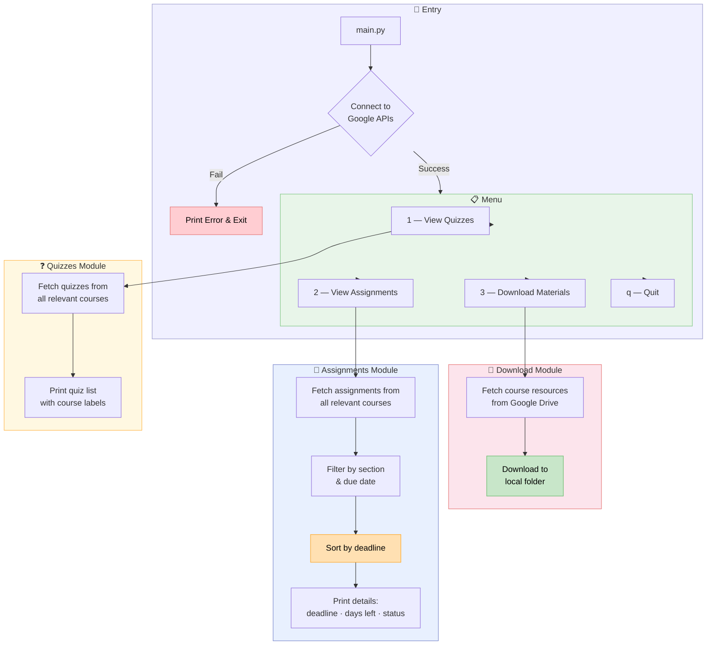

# 🤖 Google Classroom Automator

<div align="center">


**A Python tool to automatically fetch and manage your Google Classroom courses, assignments, quizzes, and materials with a simple key-press interface.**

[Features](#-features) · [Architecture](#-architecture) · [Tech Stack](#-tech-stack) · [Project Structure](#-project-structure) · [Setup](#-setup--installation) · [Usage](#-how-to-run) · [Screenshots](#-results--screenshots) · [Troubleshooting](#-troubleshooting)

</div>

---

## 📖 Overview

**Google Classroom Automator** is a Python-based script that connects to your Google Classroom and Google Drive accounts to:

- 📚 **List Relevant Courses** — displays all filtered courses for quick reference
- 📝 **View Assignments** — sorted by due date, filtered by your section, and includes submission status
- ❓ **Detect Quizzes** — scans course materials for upcoming quizzes and tests
- 💾 **Download Materials** — automatically downloads notes, PDFs, and course resources
- ⏱️ **Real-Time Action** — menu reacts immediately to a key press — no Enter required

The tool is **entirely local** and leverages Google's APIs with OAuth2 authentication, giving you full control and automation without any extra costs.

---

## ✨ Features

| Feature | Description |
|---|---|
| 📋 **Relevant Courses Display** | Lists courses filtered to your section for clarity and quick reference |
| ❓ **Quiz Detection** | Detects quizzes, MCQs, lab sessionals, and assignment-based quizzes |
| 📝 **Assignment Overview** | Shows upcoming assignments with deadlines, remaining days, and submission status |
| 💾 **Material Downloader** | Downloads all course notes and PDFs to your local machine |
| ⏱️ **Instant Keypress Menu** | Press a single key to run quizzes, assignments, or download modules — no Enter required |
| 🌐 **Google API Integration** | Fully connected to Google Classroom and Drive APIs via OAuth2 |
| ⚙️ **Customizable Filters** | Filter assignments by section and due date |
| 🔄 **Sorted Deadlines** | Assignments automatically sorted by due date |
| 💚 **Terminal Colors** | Easy-to-read output using Colorama for colored text |

---

## 🏗️ Architecture

The diagram below shows the complete data flow from startup to module execution:



**How it works, step by step:**

1. **Entry (`main.py`)** — Connects to Google Classroom and Drive via OAuth2. On failure, prints a descriptive error and exits.
2. **Menu Display** — Renders a key-press menu. The terminal immediately reacts to `1`, `2`, `3`, or `q` — no Enter key required.
3. **Quizzes Module** — Fetches all quizzes across all relevant courses and prints them with their course labels.
4. **Assignments Module** — Fetches assignments, filters by your configured section, sorts by due date, and prints each entry with deadline, days remaining, and submission status.
5. **Download Materials Module** — Fetches course resources from Google Drive and downloads notes, PDFs, and materials to a local folder.
6. **Loop** — After each module finishes, the menu is shown again until the user quits with `q`.

---

## 🛠️ Tech Stack

| Component | Tool | Notes |
|---|---|---|
| **Python** | Python 3.10+ | Core scripting |
| **Classroom API** | Google Classroom API | Fetches courses, assignments, quizzes |
| **Drive API** | Google Drive API | Downloads course materials |
| **Auth** | Google OAuth2 | `credentials.json` + `token.json` flow |
| **Terminal Colors** | Colorama | Colored, readable terminal output |
| **Date Handling** | `datetime` | Formats deadlines & calculates remaining days |
| **Key Press Input** | `msvcrt` (Windows) / `tty + termios` (Linux) | Single key press — no Enter needed |
| **Sorting & Filtering** | Custom Python functions | Section and due date-based filters |

---

## 📂 Project Structure

```
Google-Classroom-Automator/
│
├── main.py                  # 🎛️  Entry point, menu & orchestration
├── auth/
│   └── google_auth.py       # 🔑  Handles Google OAuth2 — builds Classroom & Drive services
├── modules/
│   ├── courses.py           # 📚  Fetch & filter relevant courses
│   ├── assignments.py       # 📝  Fetch, filter by section, sort by due date
│   ├── downloader.py        # 💾  Download course materials from Google Drive
│   └── quiz_detector.py     # ❓  Detect quizzes, MCQs, and tests from course materials
├── config/
│   └── settings.py          # ⚙️  Filter settings: section name, keywords, download path, etc.
├── requirements.txt         # 📋  Python dependencies
└── README.md                # 📖  This file
```

> **Important:** `credentials.json` and `token.json` must be placed in the `auth/` folder and are excluded by `.gitignore`. See [Setup](#-setup--installation) for details.

---

## 🔑 What You Need Before Starting

You need **two critical files** before the tool can connect to Google. Without them it cannot authenticate and will not run.

---

### 🔴 CRITICAL — `credentials.json`

This is your **Google OAuth2 client secret file**. It tells Google which application is requesting access so the tool can authenticate under your Google account.

**How to get it (one-time setup):**

1. Go to [console.cloud.google.com](https://console.cloud.google.com/) and sign in
2. Click **New Project** → name it (e.g. `classroom-automator`) → **Create**
3. Go to **APIs & Services** → **Enable APIs and Services**
   - Search for and enable **Google Classroom API**
   - Search for and enable **Google Drive API**
4. Go to **APIs & Services** → **OAuth consent screen** → select **External** → **Create**
   - Fill in App name, support email, developer contact (all can be your own Gmail)
   - On the **Test users** page, add your own Gmail address
5. Go to **APIs & Services** → **Credentials** → **+ Create Credentials** → **OAuth client ID**
   - Application type: **Desktop app** → name it → **Create**
6. Click **⬇️ Download JSON** next to the credential you just created
7. Rename the file to `credentials.json` and move it into the `auth/` folder:

```bash
cp ~/Downloads/credentials.json auth/credentials.json
```

> ⚠️ **Never commit this file to Git.** It is already covered by `.gitignore`. Keep a personal backup in a safe location such as your Downloads folder — if your machine is reset, restore it with the same `cp` command.

---

### 🔴 CRITICAL — `token.json`

This is your **OAuth2 access token**. It is generated automatically the first time you run the tool and complete the Google sign-in flow in the browser. You do **not** create this manually.

Once it exists, **immediately back it up**:

```bash
cp auth/token.json ~/Downloads/token.json
```

If you lose it, simply re-run the tool — a browser window will open for re-authentication and a new `token.json` will be generated automatically.

> ⚠️ **Never commit this file to Git.** It is already covered by `.gitignore`.

---

## 🚀 Setup & Installation

### Step 1: Clone the Repository

```bash
git clone https://github.com/your-username/Google-Classroom-Automator.git
cd Google-Classroom-Automator
```

### Step 2: Install Dependencies

Ensure Python 3.10+ is installed, then:

```bash
pip install -r requirements.txt
```

### Step 3: Enable Google APIs

1. Go to [console.cloud.google.com](https://console.cloud.google.com/)
2. Enable **Google Classroom API**
3. Enable **Google Drive API**
4. Configure OAuth2 credentials — see [What You Need Before Starting](#-what-you-need-before-starting)

### Step 4: Place Your Credentials

```bash
cp ~/Downloads/credentials.json auth/credentials.json
```

### Step 5: Configure `settings.py`

Open `config/settings.py` and fill in your details:

```python
# ── Your Section Filter ───────────────────────────────────────────────────────
SECTION_FILTER    = "CS-4B"       # Only courses/assignments matching this section are shown

# ── Download Settings ─────────────────────────────────────────────────────────
DOWNLOAD_PATH     = "./materials"  # Local folder where course materials are saved

# ── Assignment Filters ────────────────────────────────────────────────────────
DUE_DATE_RANGE_DAYS = 30          # Show assignments due within this many days

# ── Quiz Keywords ─────────────────────────────────────────────────────────────
QUIZ_KEYWORDS     = ["quiz", "mcq", "test", "lab sessional", "viva"]
```

### Step 6: First Run — Google Authentication

On the first run, a browser window opens for Google sign-in:

```bash
python main.py
```

Sign in to your Google account when prompted. The session is saved as `auth/token.json` and reused automatically on every subsequent run.

---

## 🏃 How to Run

```bash
python main.py
```

**Menu keys:**

| Key | Action |
|---|---|
| `1` | View Quizzes across all relevant courses |
| `2` | View Assignments with deadlines and submission status |
| `3` | Download all course materials to local folder |
| `q` | Quit |

Press the key **once** — the module executes immediately without pressing Enter.

---

### What Happens After Launch

```
✅ Connects to Google Classroom & Drive via OAuth2
✅ Fetches and displays all relevant courses (filtered by section)
✅ Menu renders instantly, waiting for a single keypress

── Option 1 — Quizzes ──────────────────────────────────────────────────────
  ❓  Iterates through all relevant courses
  🔍  Scans coursework titles and descriptions for quiz keywords
  📋  Prints detected quizzes with course name and due date

── Option 2 — Assignments ──────────────────────────────────────────────────
  📝  Fetches all coursework from relevant courses
  🔽  Filters by your configured section
  📅  Sorts by due date (earliest first)
  🖨️  Prints each assignment: title · due date · days remaining · status

── Option 3 — Download Materials ───────────────────────────────────────────
  💾  Iterates through all relevant courses
  📁  Fetches attached Drive files (PDFs, notes, slides)
  ⬇️  Downloads each file to ./materials/<course-name>/
  ✅  Prints download confirmation for each file

── Loop ────────────────────────────────────────────────────────────────────
  🔄  Menu reappears after each module completes
  🚪  Press q at any time to exit cleanly
```

---

## 📸 Results & Screenshots

### ✅ Relevant Courses Listed

On launch, the tool displays all courses filtered to your configured section — no clutter from unrelated classes.

---

### ❓ Quizzes Detected

All quizzes, MCQs, lab sessionals, and test-style assignments are pulled from every relevant course and printed in one clean list.

---

### 📝 Assignments with Deadlines

Assignments appear sorted by due date, with the number of days remaining and current submission status shown inline.

---

### 💾 Materials Downloaded

Course notes, PDFs, and slides are downloaded to your local machine with a confirmation message for each file.

---

## ⚠️ Troubleshooting

### Connection Failure / Auth Error

Your credentials or token may be missing or expired. Check that `auth/credentials.json` exists, then delete `auth/token.json` and re-run to trigger a fresh sign-in:

```bash
rm auth/token.json
python main.py
```

---

### No Assignments or Quizzes Shown

- Confirm your `SECTION_FILTER` in `config/settings.py` matches the section name exactly as it appears in Google Classroom.
- Confirm that assignments/quizzes are actually posted in your Classroom courses.
- Try widening the `DUE_DATE_RANGE_DAYS` value if deadlines are far out.

---

### Material Download Issues

- Verify the **Google Drive API** is enabled in your Google Cloud Console.
- Check that the `DOWNLOAD_PATH` folder is writable.
- If a specific file fails, the file may not be a Drive-hosted attachment (e.g., a YouTube link won't download).

---

### Key Press Not Working

- On **Windows**, `msvcrt` is used automatically — no extra setup needed.
- On **Linux/macOS**, `tty` and `termios` are used. If the menu requires Enter, ensure you're running in a real terminal (not an IDE console).

---

## ⚖️ Disclaimer

This project is for **educational and personal productivity purposes only**. Ensure your use complies with your institution's policies on automated access to academic platforms.

---

## 📄 License

MIT License — see [LICENSE](LICENSE) for details.

---

## 🙏 Acknowledgements

- [Google Classroom API](https://developers.google.com/classroom) — course, assignment, and quiz data
- [Google Drive API](https://developers.google.com/drive) — material downloads
- [Colorama](https://pypi.org/project/colorama/) — cross-platform colored terminal output
- Python `datetime` — deadline formatting and remaining-days calculation

---

<div align="center">

Made with ❤️ by [git-blame-zulqarnain](https://github.com/git-blame-zulqarnain)

⭐ **Star this repo** if it saved you from manually opening 6 classroom tabs at 11 PM

</div>